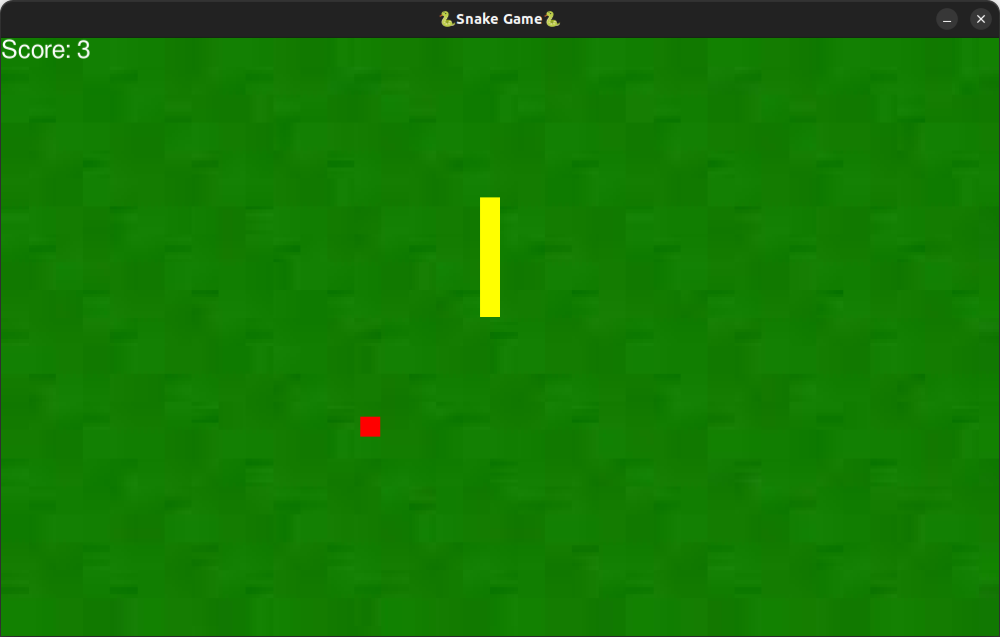

# Snake-Game

## Overview
This is a simple Snake Game built using Python and the Pygame library. The objective is to control a snake to eat food, grow longer, and avoid collisions with the walls or itself. The game features a colorful interface and a pause option.

## Features
Play the game: Control the snake using arrow keys.
Eat food: Each time the snake eats food, it grows longer and the score increases.
Game Over: The game ends if the snake collides with the wall or itself.
Restart: Press Enter to restart the game after Game Over.
Pause/Resume: Press the Space bar to pause and resume the game.

## Requirements
Python 3.x
Pygame library
